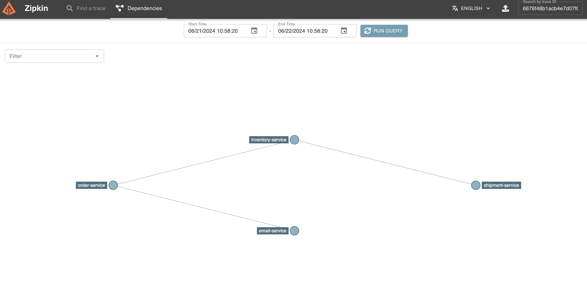

# Spring Boot 3 Distributed Tracing
This is a demo project of spring boot 3 integration with micrometer and zipkin

> Note: Sleuth is not compatible with spring boot 3.X, use micrometer instead
## Architecture



+ order service
+ shipment service
+ inventory service
+ email service

For simplicity, all services uses most simple code to simulate request chain, such as:
+ Application class also serves as controller
+ Business logic is just printing log rather than real business logic
+ Directly store the constants in Application class
+ Use `RestTemplate` instead of `OpenFeign`

## How to Start

First, run zipkin server in docker using following command:

```bash
# Pull the latest Zipkin Docker image
docker pull openzipkin/zipkin

# Run the Zipkin container with the name "my_zipkin"
docker run -d --name my_zipkin -p 9411:9411 openzipkin/zipkin
```

You should be able to visit `http://localhost:9411` and see the zipkin dashboard.

Then, clone this repo and install dependencies:
```shell
mvn clean install
```

Next, run all applications, and hit the order api in terminal:
```shell
curl --location 'http://localhost:8080/orders'
```

Check the trace Id in the log and search trace in the zipkin dashboard. You should be able to see following diagram


## Tech Stack

+ Spring Boot 3
+ Micrometer
+ Zipkin
+ Docker
+ Rest Template


## Note
When using `RestTemplate`, make sure config restTemplate with following. Otherwise, the traceId will not propagate to downstream service.
```java
@Configuration
public class ApplicationConfig {
    @Bean
    public RestTemplate restTemplate(RestTemplateBuilder builder) {
        return builder.build();
    }
}

```

Reference: https://github.com/spring-projects/spring-boot/issues/34821